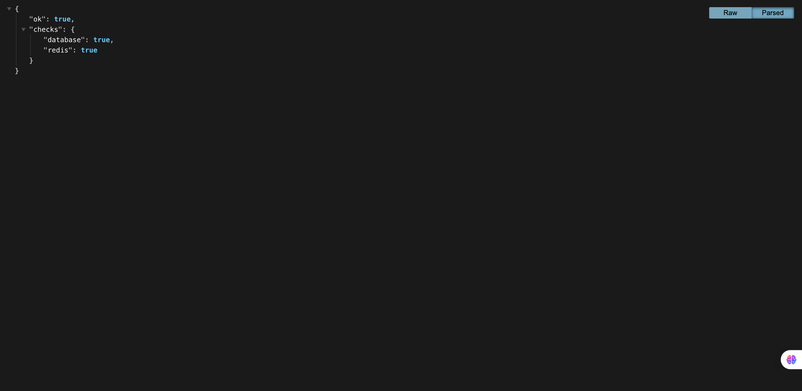
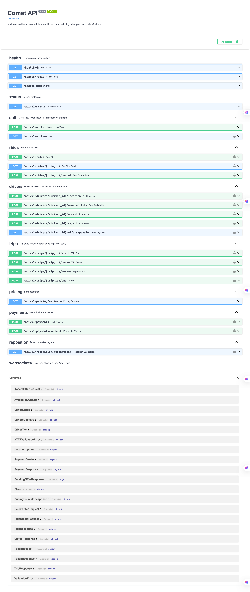

# Comet API

Production-oriented **Python 3.12 + FastAPI** modular monolith for a **multi-region ride-hailing** MVP: async SQLAlchemy + Alembic, Redis (GEO + cache), **Celery** workers, JWT auth, SlowAPI rate limiting, structlog, standardized errors, health checks, optional New Relic, Docker Compose (API + Postgres + Redis + **worker**), and CI with coverage.

## Architecture & docs

| Document | Purpose |
|----------|---------|
| [docs/HLD.md](docs/HLD.md) | Components, data flow, scaling notes |
| [docs/LLD.md](docs/LLD.md) | Redis keys, locking, FSM, idempotency, Celery |
| [docs/PERFORMANCE.md](docs/PERFORMANCE.md) | Targets, load tests, coverage notes |
| [docs/DEMO.md](docs/DEMO.md) | Checklist to record a demo video |
| [docs/postman_collection.json](docs/postman_collection.json) | Postman v2.1 starter collection |

**API prefix:** all versioned REST routes are under **`/api/v1`**. WebSocket: **`/api/v1/ws?token=…&channel=…`** (see [docs/DEMO.md](docs/DEMO.md)).

**Ride vs trip:** `POST /api/v1/rides` returns **`ride_id`** and **`trip_id`**. Trip lifecycle uses **`trip_id`** in paths (`/api/v1/trips/{trip_id}/start|pause|resume|end`).

## Quick start (Docker Compose)

1. **Clone** and `cd` into the repo.

2. **Environment**  
   `cp .env.example .env` and adjust. Compose injects `DATABASE_URL` / `REDIS_URL` for `api` and `worker`; keep local secrets out of git.

3. **Start stack** (API + Postgres + Redis + Celery worker):

   ```bash
   docker compose up --build
   ```

   Default API URL: `http://127.0.0.1:8000` (override with `COMPOSE_API_PUBLISH_PORT` if 8000 is taken).

4. **Migrations**

   ```bash
   make docker-migrate
   ```

   Equivalent: `docker compose run --rm api alembic upgrade head`

5. **Health check** — open `http://127.0.0.1:8000/health` in the browser. When Postgres and Redis are wired correctly you should see `ok: true` and per-component checks:

   

6. **Swagger (interactive API)** — explore and execute requests at `http://127.0.0.1:8000/docs`. This is the main way to try rides, drivers, trips, and payments locally without a separate frontend:

   

7. **Optional Redis seed** (surge + reposition stub stats)

   ```bash
   docker compose run --rm api python scripts/seed.py
   ```

## Local Python (without Docker for the app process)

```bash
python3.12 -m venv .venv && source .venv/bin/activate
pip install -e ".[dev]"
cp .env.example .env
# Point DATABASE_URL / REDIS_URL at reachable services
make migrate
make run
```

## Flows (condensed)

1. **Auth (dev):** `POST /api/v1/auth/token` with `{ "subject": "<uuid>", "role": "rider"|"driver" }` → JWT.
2. **Driver:** `POST …/availability` (online) → `POST …/location` (updates **Redis GEO** `driver:{uuid}` + throttled DB columns).
3. **Rider:** `POST /api/v1/rides` (optional `Idempotency-Key`; blocks duplicate active rides) → enqueues **`comet.match_ride`**.
4. **Worker:** GEOSEARCH + rank → Redis offer + TTL → driver polls `GET …/offers/pending` or WS.
5. **Accept:** `POST …/accept` — transactional **`FOR UPDATE`** on ride + driver; clears offer; WS broadcast.
6. **Trip:** `start` / `pause` / `resume` / `end` (Haversine + surge hash fare on **end**).
7. **Payment:** `POST /api/v1/payments` after trip **completed**; mock PSP (amount with cents `.xx99` forces failure + retry task).

## Tests, lint, coverage

```bash
make test
make lint
make checks   # docker compose --profile checks (ruff + pytest + cov, threshold 65%)
```

CI: `.github/workflows/ci.yml` — Ruff, pytest with **`--cov=app --cov-fail-under=65`**, coverage XML artifact, Docker build.

## Load testing

```bash
pip install locust   # or use `.[dev]` which includes locust
locust -f scripts/load/locustfile.py --host=http://127.0.0.1:8000
```

See [docs/PERFORMANCE.md](docs/PERFORMANCE.md).

## Celery worker (compose service `worker`)

- **Command:** `celery -A app.workers.celery_app.celery_app worker -l INFO -Q comet`
- **Broker:** Redis (`CELERY_BROKER_URL` defaults to `REDIS_URL`).

## Environment variables (summary)

| Variable | Notes |
|----------|--------|
| `DATABASE_URL` | `postgresql+asyncpg://…` for API |
| `REDIS_URL` | Async API + Celery broker |
| `JWT_SECRET_KEY` | HS256 signing (change outside local) |
| `CELERY_BROKER_URL` | Optional override |
| `RATE_LIMIT_ENABLED` | `true` + SlowAPI uses Redis backend |
| `MATCHING_OFFER_TTL_SECONDS` | Offer TTL (default 60) |
| `DRIVER_LOCATION_DB_THROTTLE_SECONDS` | DB persist throttle for location |
| `NEW_RELIC_*` | Optional APM |

Full template: [.env.example](.env.example).

## New Relic

Set `NEW_RELIC_LICENSE_KEY` (and optionally `NEW_RELIC_APP_NAME`). Agent bootstraps in `app/main.py` before the ASGI app; no key = no-op.

## Layout

- `app/api/v1/` — routers (rides, drivers, trips, pricing, payments, auth, WS)
- `app/core/` — settings, logging, middleware, security (JWT), limits
- `app/db/` — async engine/session
- `app/matching/`, `app/pricing/`, `app/services/`, `app/workers/`, `app/websockets/`
- `alembic/`, `docker/`, `scripts/`, `tests/`, `docs/`
# comet-assesment
